---
# IBM Cloud - Getting Started with CF
---


+++


# Table of Content

- [1. Platform Overview](#1-platform-overview)
- [2. Objectives](#2-objectives)
- [3. Deploy with the console](#3-deploy-with-the-console)
    + [Task 1 : Login to IBM Cloud](#task-1---login-to-ibm-cloud)
    + [Task 2 : Access the Dashboard](#task-2---access-the-dashboard)
    + [Task 3 : Catalog](#task-3---catalog)
    + [Task 4 : Cloud Foundry](#task-4---cloud-foundry)
    + [Task 5 : Choose the .JS sample](#task-5---choose-the-js-sample)
    + [Task 6 : Create a sample app](#task-6---create-a-sample-app)
    + [Task 6 : Review and create](#task-6---review-and-create)
    + [Task 7 : The app is running](#task-7---the-app-is-running)
    + [Task 8 : Get access to the app](#task-8---get-access-to-the-app)
    + [Results](#results)
- [4. Modify and deploy with the CLI](#4-modify-and-deploy-with-the-cli)
    + [Task 1 : Download the code](#task-1---download-the-code)
    + [Task 2 : Delete the app in the IBM Cloud](#task-2---delete-the-app-in-the-ibm-cloud)
    + [Task 3 : Go to the directory](#task-3---go-to-the-directory)
    + [Task 4 : login with the CLI](#task-4---login-with-the-cli)
    + [Task 5 : Create a DB](#task-5---create-a-db)
    + [Task 6 : Push the app](#task-6---push-the-app)
    + [Task 7 : Bind the App and the DB](#task-7---bind-the-app-and-the-db)
    + [Task 8 : Test the app](#task-8---test-the-app)
    + [Task 9 : Using the new app](#task-9---using-the-new-app)
    + [Task 10 : Modify app.js](#task-10---modify-appjs)
    + [Task 10 : Use Cloudant DB console](#task-10---use-cloudant-db-console)
    + [Task 11 : Push the modified app](#task-11---push-the-modified-app)
    + [Task 12 : Delete app and service](#task-12---delete-app-and-service)
    + [Results](#results-1)


+++

# 1. Platform Overview

IBM's innovative cloud computing platform combines platform as a service (PaaS) with infrastructure as a service (IaaS) and includes a rich catalog of cloud services that can be easily integrated with PaaS and IaaS to build business applications rapidly.

IBM Cloud (formerly Bluemix) has deployments that fit your needs whether you are a small business that plans to scale, or a large enterprise that requires additional isolation. You can develop in a cloud without borders, where you can connect your private services to the public IBM Cloud services available from IBM. You and your team can access the apps, services, and infrastructure in IBM Cloud and use existing data, systems, processes, PaaS tools, and IaaS tools. Developers can tap into the rapidly growing ecosystem of available services and runtime frameworks to build applications using polyglot programming approaches.

With IBM Cloud, you no longer have to make large investments in hardware to test out or run a new app. Instead, we manage it all for you and only charge for what you use. IBM Cloud provides public, dedicated, and local integrated deployment models.

You can take an idea from inception, to development sandbox, to a globally distributed production environment with compute and storage infrastructure, open source platform services and containers, and software services and tools from IBM, Watson, and more. Beyond the capabilities of the platform itself, IBM® Cloud also provides flexible deployment. Provision IBM® Cloud resources on-premises, in dedicated private cloud environments, or in the public cloud, and manage the resources from all three types of environments in a single dashboard.

All IBM cloud resources that are deployed in public and dedicated environments are hosted from your choice of IBM® Cloud Data Center locations around the world. IBM Cloud Data Centers provide regional redundancy, a global network backbone connecting all data centers and points of presence, and stringent security controls and reporting. Through IBM Cloud Data Centers, IBM can meet your most demanding expansion, security, compliance, and data residency needs.

**IBM enables you to:**

Deploy high performance compute and storage infrastructure in secure IBM Cloud Data Centers around the world.
Test and adopt a broad range of cloud services and capabilities from IBM, open source communities, and third-party developers.
Connect to all of your legacy systems and apps from a single, scalable, cloud platform through private network and API capabilities.
Spin up and turn down resources in real time as your business needs or workload demands change.
Apps

The dashboard provides everything you need to get your apps up and running, and to manage those apps while they run. IBM Cloud provides various boilerplates and runtimes:

A **boilerplate or Starter Kit** is a template for an application and its associated runtime environment and predefined services for a specific domain.
A runtime is the set of resources that is used to run an app, provided as containers for different types of apps.
IBM Cloud provides various ways for you to run your apps, for example, Cloud Foundry and IBM® Cloud Container Service. Use IBM® Cloud Container Service to run Docker containers in a hosted cloud environment on IBM Cloud.

You can use IBM® Cloud Functions for distributed, event-driven computing. Cloud Functions runs application logic in response to events or direct invocations from web or mobile apps over HTTP.

You can use IBM Cloud Mobile services to incorporate pre-built, managed, and scalable cloud services into your mobile apps.

**Services**

The dashboard provides access to the IBM Cloud services available from IBM® and third-party providers. These include Watson, Internet of Things, Analytics, Mobile, and DevOps services:

Deliver innovative new applications faster and cheaper with just the right features using IBM DevOps services and the IBM Cloud Garage Method. When you adopt DevOps practices and create a culture of innovation and agility, you can use iterative practices and change direction in response to the market.
Blockchain is a peer-to-peer distributed ledger technology for a new generation of transactional applications that establishes trust, accountability, and transparency while streamlining business processes.
Watson gives your apps the power of cognitive computing with a full suite of speech, vision, and data APIs. Solve your most complex business problems by deploying a cognitive platform with Watson services.
IBM enables you to do more with rich, integrated cloud databases and Data & Analytics services.
The IBM Internet of Things service lets your apps communicate with, and consume data that is collected by, your connected devices, sensors, and gateways. Our recipes make it easy to get devices connected to our Internet of Things cloud. Your apps can then use our real-time and REST APIs to communicate with your devices and consume the data you've set them up to collect.
IBM offers a mobile backend infrastructure where you can build multiplatform, native, or hybrid apps while also being able to monitor and test them. You can also enhance your app with analytics, security, user insight, and continuous delivery.
IBM Cloud also provides experimental services that you can try out. To learn about service types and availability, see IBM Cloud services.

**Infrastructure**

The dashboard provides various services to fit your cloud infrastructure needs.

IBM Cloud infrastructure provides the highest performing cloud infrastructure available. IBM Cloud infrastructure is one platform, which takes data centers around the world that are full of the widest range of cloud computing options, then integrates and automates everything. IBM Cloud Data Centers are filled with first class computing, storage, and networking gear. Each location is built, outfitted, and operated in the same way, so you get exactly the same capabilities and availability anywhere where we are present. Locations are connected by the industry’s most advanced network-in-a-network, which integrates distinct public, private, and internal management networks to deliver lower total networking costs, better access, and higher speed. Also, the data centers and network share a single proprietary management system. One management tool lets you control everything--every bare metal server, virtual server, and storage device--all accessible by API, portal, and mobile applications.

IBM Cloud infrastructure offers powerful bare metal servers and flexible virtual servers in a single seamless platform. All are provided on demand and billed on monthly or hourly terms. Bare metal servers provide the raw horsepower for your processor-intensive and disk I/O-intensive workloads and can be configured to your exact specifications. Virtual servers allow for high speed of deployment, flexible scalability, and pay-as-you-go billing. For high performance computing, give your cloud a boost with graphics processing unit (GPU) servers, available by the hour or monthly.

IBM Cloud infrastructure offerings are connected to a three-tiered network, segmenting public, private, and management traffic. Infrastructure on a customer's IBM Cloud account might transfer data between such infrastructure across the private network at no cost. Infrastructure offerings, such as bare metal servers, virtual servers, and cloud storage, connect to other applications and services in the IBM Cloud catalog, such as Watson services, containers, or runtimes, across the public network. Data transfer between those two types of offerings is metered and charged at standard public network bandwidth rates.

# 2. Objectives 


In this workshop, you will use **Cloud Foundry** to :
- Deploy a simple application from the IBM Cloud web interface. 
- Use the cf command-line to deploy an application.

# 3. Deploy with the console

This exercise will show you how to deploy a simple application from the IBM Cloud web interface.


### Task 1 : Login to IBM Cloud
Open a browser window and type http://bluemix.net

### Task 2 : Access the Dashboard
Click LOG IN and then enter your login information on the IBM id page and click Sign in. You should see your dashboard view.

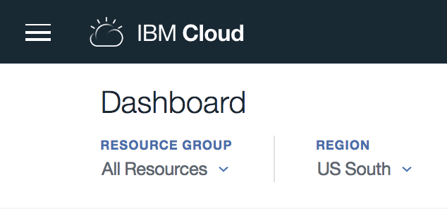

### Task 3 : Catalog
Click on **Menu** on the top left side of the screen.


### Task 4 : Cloud Foundry
Find and click on the **Cloud Foundry** entry

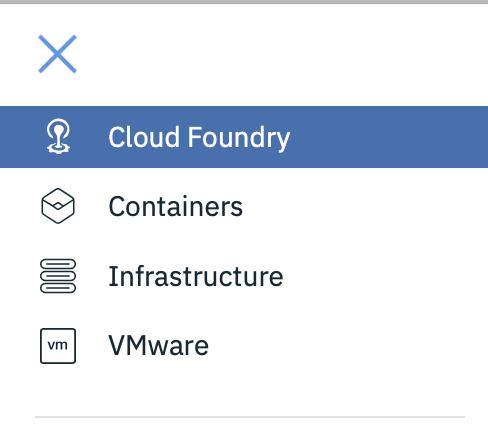

### Task 5 : Choose the .JS sample
From the overview, Click the .JS button:

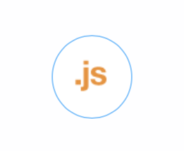

### Task 6 : Create a sample app

A new screen will open a form to define your new application.

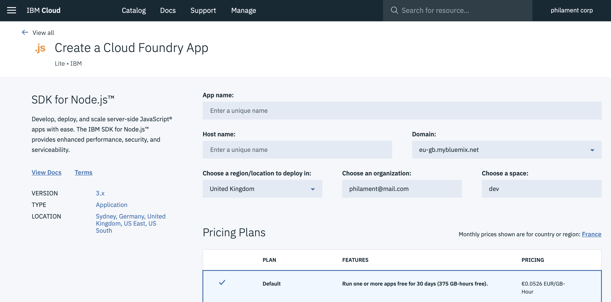

Type a unique App name like **myappXXX** where XXX matches with your initials or some numbers. 

> The host name must be <span style="background-color:yellow;">**unique**</span>. This is why you should specify this 3 or more alphanumeric characters. 

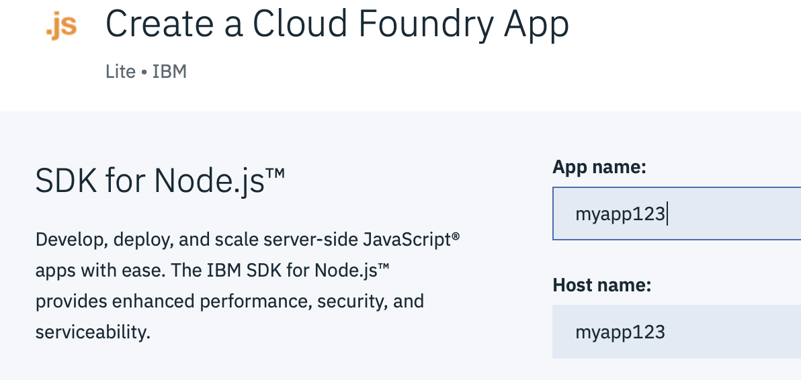


### Task 6 : Review and create
> Scroll down to the bottom and look around the different services and the pricing plans. 

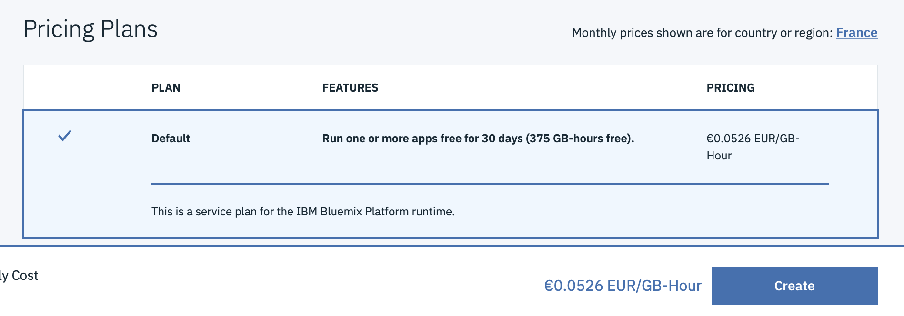

> If a message appears saying that the name is already taken then change the name. 

Click **Create** at the bottom.
The node.JS application will be deployed and started: 
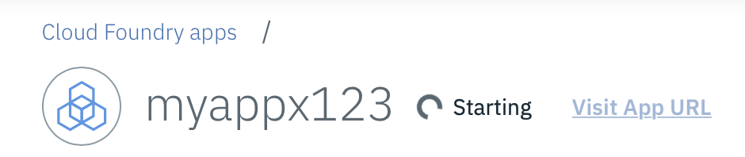

### Task 7 : The app is running
After a few minutes the following screen should appear. 

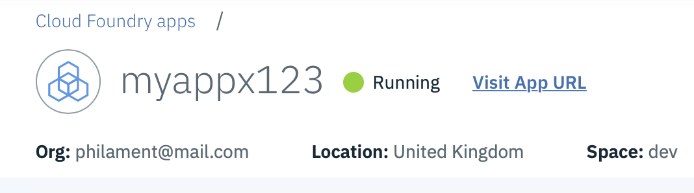

> The application should be running (green light). You also find the ORG the location (region) and the space. In less than one minute, you have started a boilerplate (example) application and the needed resources have been added and configured automatically for you by the IBM Cloud.

### Task 8 : Get access to the app
Click on **Visit App URL** near Running. 
> A window will open and shows your application. 
> 
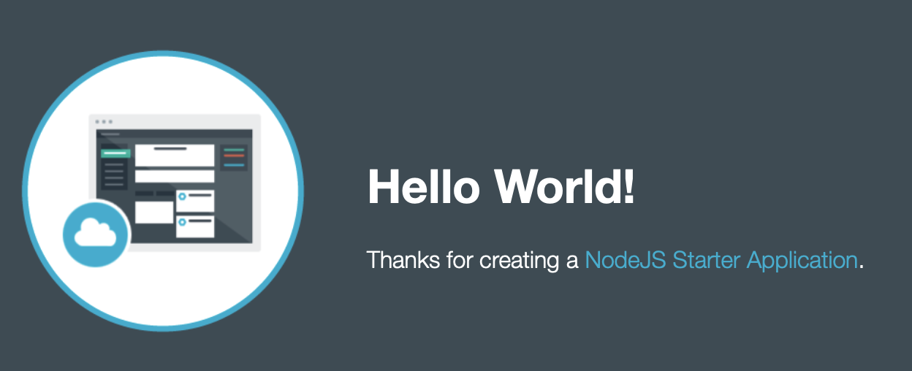

###  Results
<span style="background-color:yellow;">Successful exercise ! </span>
You finally did the following points:
- [x] You login on the  IBM Cloud
- [x] You browsed the catalog
- [x] You created an application based on a boilerplate
- [x] You started this application
- [x] You were able to manipulate the created application

+++
# 4. Modify and deploy with the CLI
In this exercise, you will use the **ibmcloud** command-line interface (CLI) to work with the IBM Cloud. You use this tool in a terminal or command window on your workstation. We also use a sample application. 

> Prerequisites : you should have installed the command-line interface for the IBM Cloud : [ibmcloud CLI](https://console.bluemix.net/docs/cli/reference/bluemix_cli/get_started.html#getting-started) and follow the instructions for your operating system.

### Task 1 : Download the code

Open an internet browser and type: https://github.com/IBM-Bluemix/nodejs-cloudant

On the page, select “**clone or download**” green button and click on “**Download zip**”.

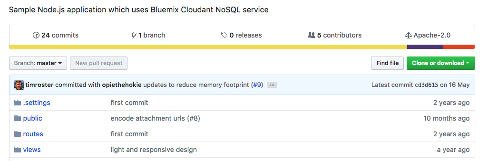

After the starter package was downloaded, move your zip file to a **directory** on your computer. **Extract the package** by double-clicking or right-clicking and click Extract or Unarchive depending of your operating system into a **myapp directory**.


### Task 2 : Delete the app in the IBM Cloud

**Delete** the deployed application so that you can deploy it again from the command line. Click the Getting Started page of your myapp application. Then click the **three dots** button in the application, and then click **Delete**.


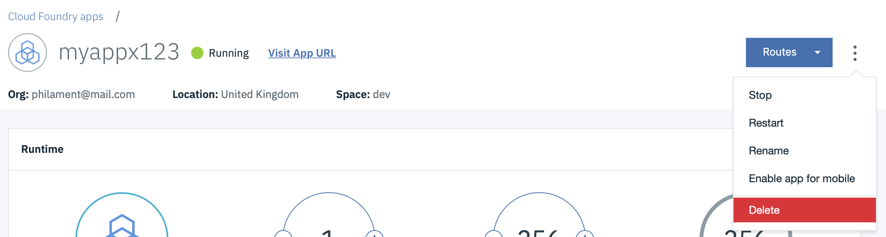

Don't forget to tick the boxes to also delete the associated **services** and the **routes**.

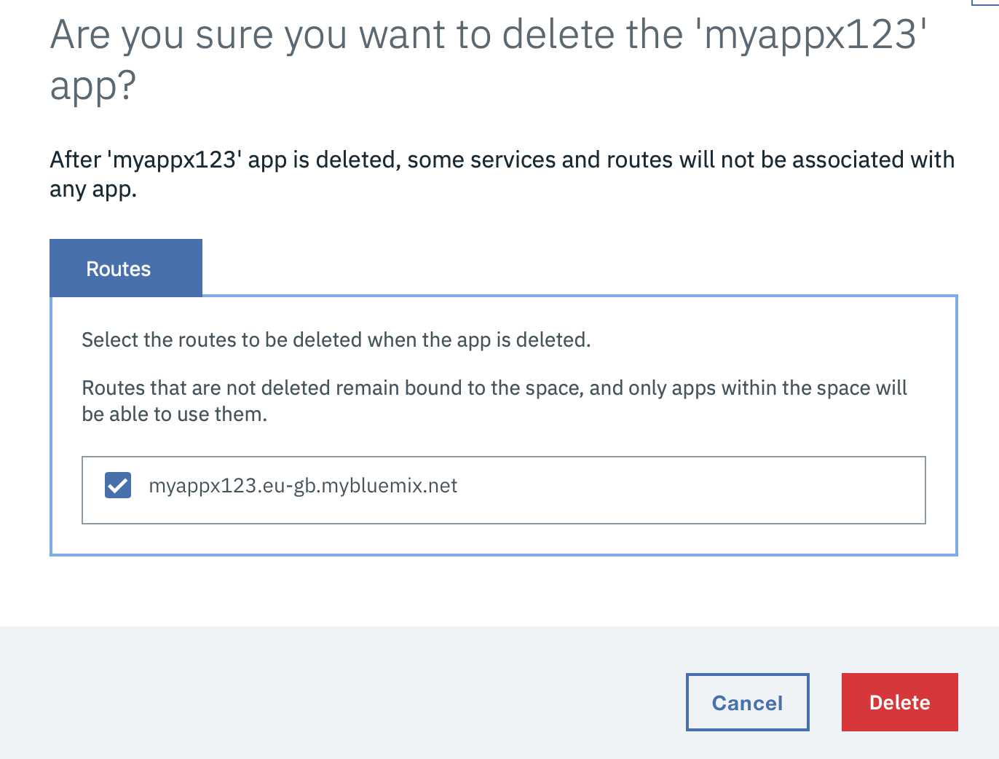

Then click **Delete** to remove the application, the associated services and the routes.


### Task 3 : Go to the directory

Open a terminal or a command-line window and change the directory to the location where you extracted the downloaded sample application.

 > you should see the following files and directories. Also locate the **package.json** file. 

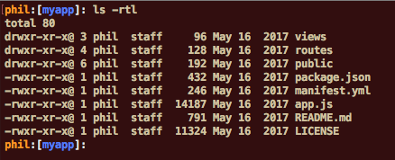


### Task 4 : login with the CLI

Log in to **IBM Cloud** by issuing one of the following commands. Use the same region that you used in the **IBM Cloud** web interface:

 Region: US South
 
`ibmcloud login -a https://api.ng.bluemix.net`

 
 Region: United Kingdom
 
 `ibmcloud login -a https://api.eu-gb.bluemix.net`

 
 Region: Sydney

 `ibmcloud login -a https://api.au-syd.bluemix.net`

 
 Enter your **email** and **password** that you used to log in to the IBM Cloud web interface. Then select the account. See below an example:
 
 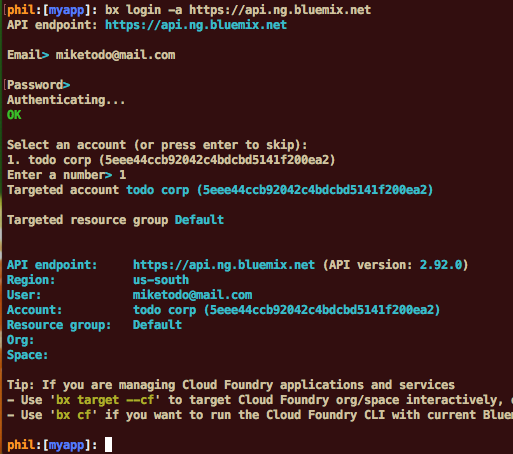
 
 As you can see the ORG and the SPACE are empty. Use the following command to target your organization and default space :

`ibmcloud target --cf`


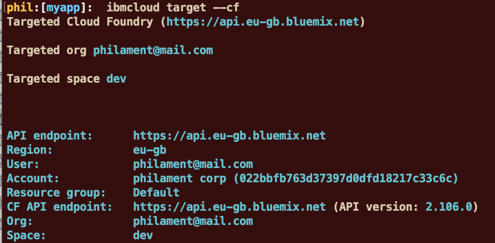


### Task 5 : Create a DB

Before you deploy the application, deploy a Cloudant database. View the available services by running this command : 

`ibmcloud catalog service-marketplace`

In the list of displayed services, find the **cloudantNoSQLDB** service. Then create a new service instance with the following command: 

`ibmcloud cf cs cloudantNoSQLDB Lite xxxCloudant`


Where:
- **CloudantNoSQLDB** is the name of the service from the ibmcloud marketplace command.
- **Lite** is the name of the service plan that you want to use from the cf marketplace command.
- **xxxCloudant** is the name of the service *instance* that you want to use. Enter your own name rather than Cloudant. You will use this new name when connecting (binding) the service to the application. xxx should be your initials or some numbers to uniquely identify this instance.

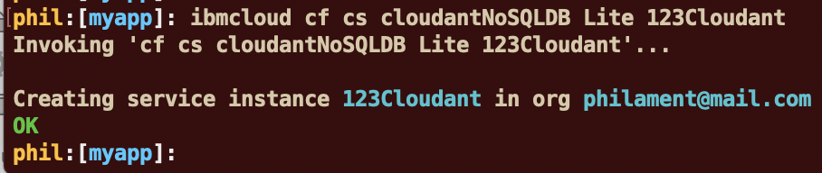

To view your created DB, use the following command:

`ibmcloud cf service xxxCloudant`

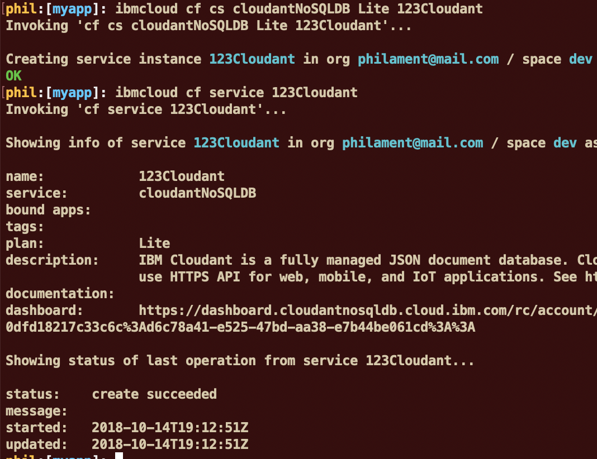


### Task 6 : Push the app

Push the application to Bluemix by entering the following command. Change the application name to your unique name:

`ibmcloud cf push myappXXX -c "node app.js" -m 128M --no-manifest --no-start`
 
> Be sure that you are on the directory of the application.
 
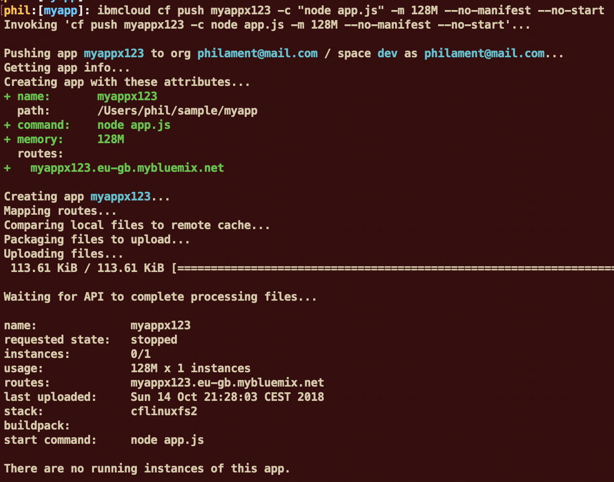
 
 Where:
-   **myappXXX** is the application name and host name.
-	**-c** specifies the command to start the application.
-	**-m** specifies the amount of memory to allocate to each application instance. The default is 1 GB.
-	**--no-manifest** instructs to CLI tool to ignore the supplied manifest, which will be explained later.
-	**--no-start** instructs to CLI tool not to automatically start the application.

We don’t want to allow the application to automatically start because it needs a database to run. You must link the Cloudant database instance to the application before you start the application.  

### Task 7 : Bind the App and the DB

Link the database and application together by using the following command. Substitute the application name and service instance names that you used previously:

`ibmcloud cf bs myappXXX XXXCloudant`

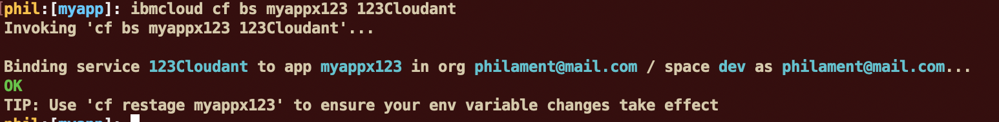

Start an application by running the following command. Substitute the name of your application:

`ibmcloud cf start myappXXX`
 
After a long list of messages, you should see something like this:
 
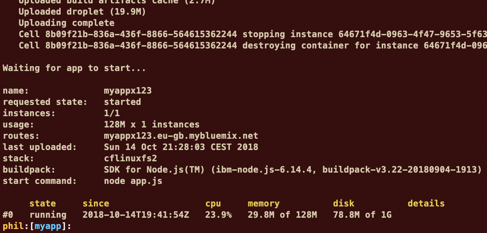
  
> The last line is the most important one : it shows that your application is running. 


### Task 8 : Test the app

Go back to the IBM Cloud console (Web interface) and refresh the Dashboard. Click on your application (that should be running).

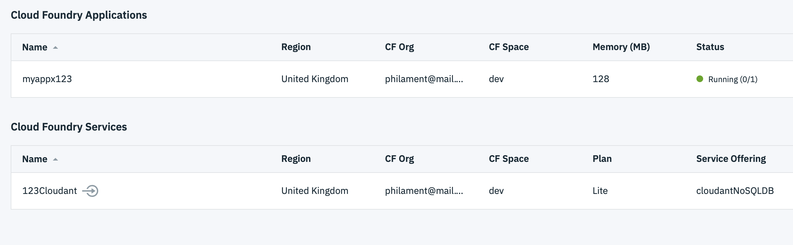

Click on the application and then click on **Visist App URL**
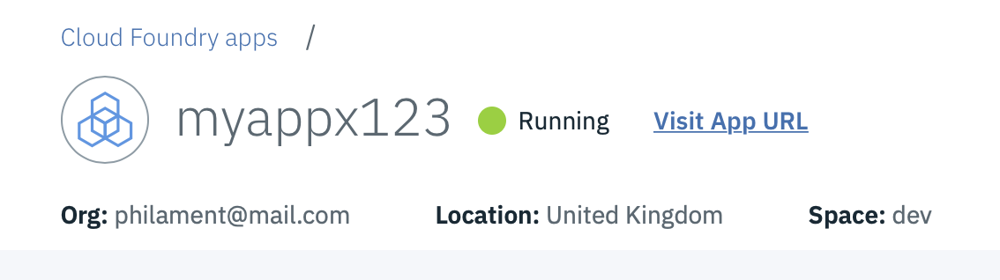

Here is the application screen:

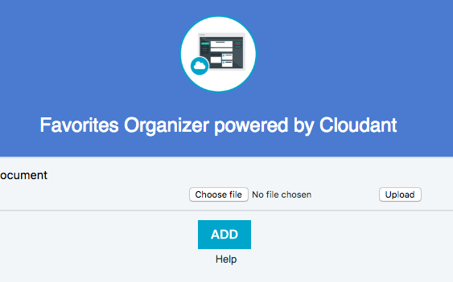


### Task 9 : Using the new app 
Test the application by uploading a file in the the Cloudant Database. To do so, click on **choose file**, then find a text file or a csv file on your computer and click **Upload** to upload this file in the Cloudand DB.


> The uploaded file should appear on the left side of the screen. You can repeat this operation to load few files in the Cloudant DB. 

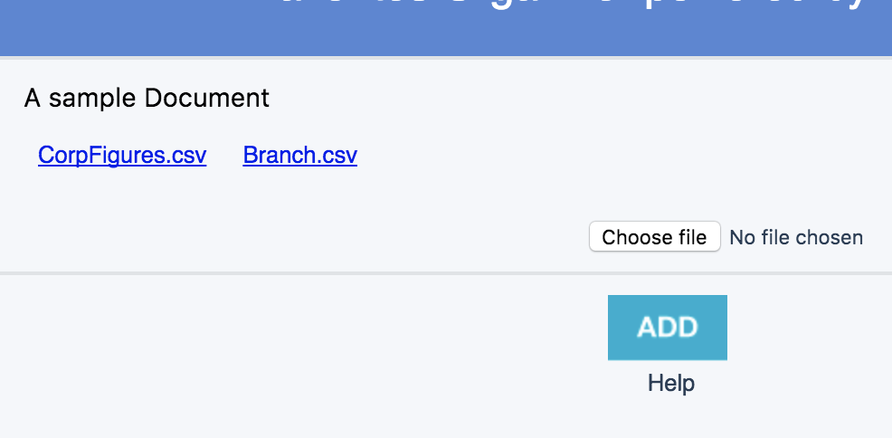


### Task 10 : Modify app.js

In a text editor on your laptop, open the file **app.js** in the myapp directory and modify the **document name** of the file, the **file description**, and the **value**: 
- Line 354: Change the docName from 'sample_doc' to '**test_doc**'
- Line 355: Change the docDesc from 'A sample Document' to '**A test Document**' 
- Line 358: Change the value from 'A sample Document' to '**A test Document**'

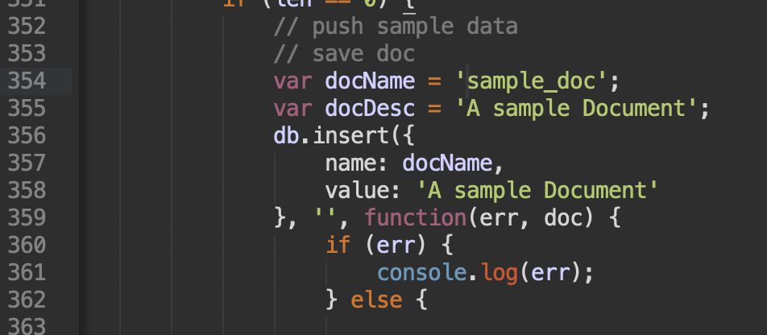

Save the file. 

### Task 10 : Use Cloudant DB console

We have just modified the code that creates the sample document in the database. The **sample document** must be deleted from the database before you restart the application to allow the database to be populated again. Click on the **Cloudant Connection** at the bottom of the application overview:

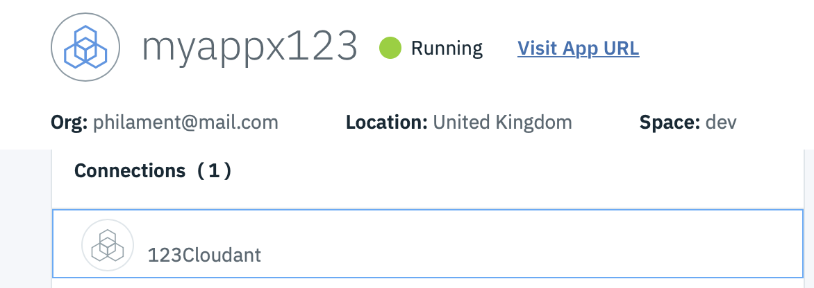

Then click on the** link** close to the name of the DB to get access to the Cloudant DB console:


And then click on the **green button** to launch the Cloudant DB console:

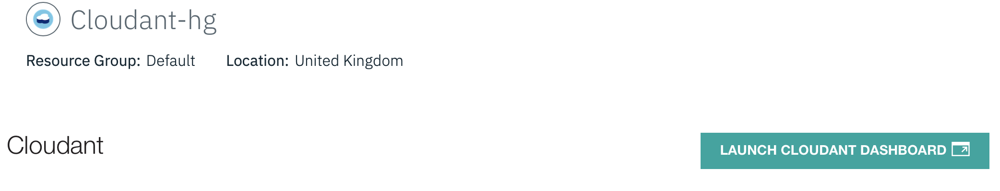

At this point, locate the **my_sample_db** and click on that link:

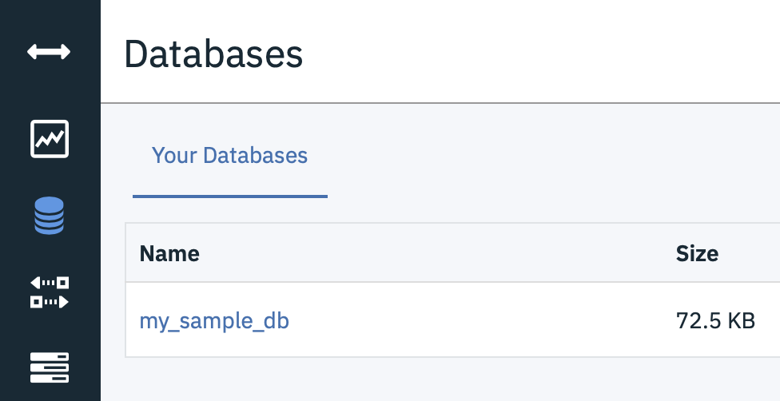

Edit the database document (this should be the sample document):

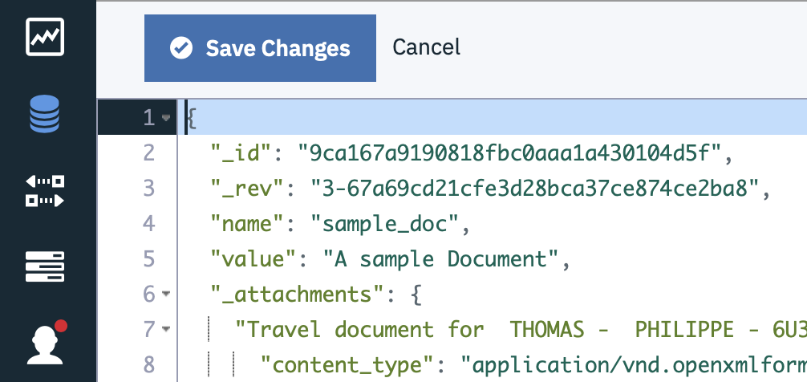

Delete the document by clicking on the dustbin on the right:

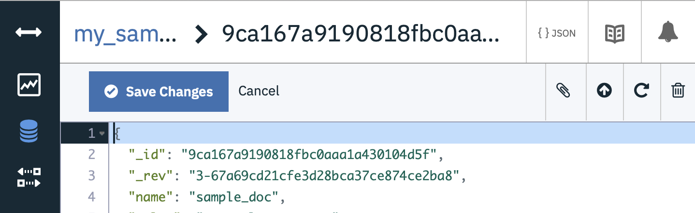

Confirm the deletion if necessary.
You can close the Cloudant console. 

### Task 11 : Push the modified app 

Redeploy and push your application from the command-line:

`ibmcloud cf push myappXXX -c "node app.js" -m 128M --no-manifest`


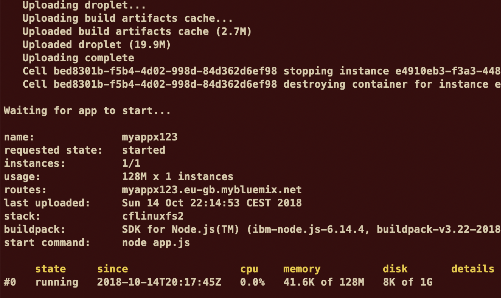

Go back to the IBM Cloud console, select the application and try the **Visit App URL** link again. You will notice that a test_doc has replaced the sample_doc in the main menu.

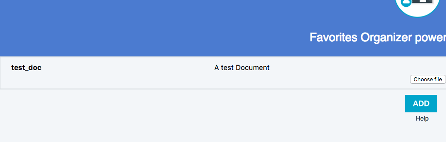
 


### Task 12 : Delete app and service

Delete the application and service and confirm the deletion when prompted by running the following two commands:

This command deletes the app and routes:

`ibmcloud cf d myappXXX –r`

Output:
```console 
ibmcloud cf d myappx123 
Invoking 'cf d myappx123'...

Really delete the app myappx123?> yes 
Deleting app myappx123 in org philament@mail.com / space dev as philament@mail.com...
OK

```


This command deletes the Cloudant DB service:

`ibmcloud cf ds xxxCloudant`

Output:
```console 
 ibmcloud cf ds 123Cloudant
Invoking 'cf ds 123Cloudant'...


Really delete the service 123Cloudant?> yes
Deleting service 123Cloudant in org philament@mail.com / space dev as philament@mail.com...
OK
```
 

###  Results
<span style="background-color:yellow;">Successful exercise ! </span>

You finally did the following points:
- [x] You login with the CLI from a terminal window
- [x] You browsed the catalog from the CLI
- [x] You downloaded the application from GitHub
- [x] You deployed the application using the push command 
- [x] You created the DB service instance from the CLI
- [x] You started this application
- [x] You were able to manipulate the created application
- [x] You deleted the app and service from the CLI


---
# End of Lab
---
