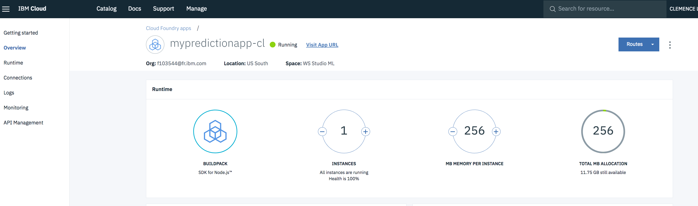
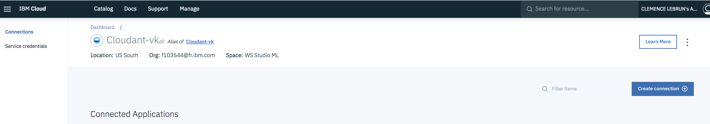
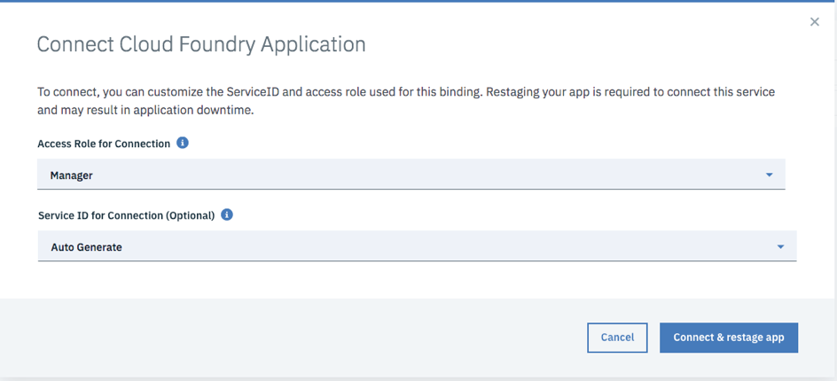
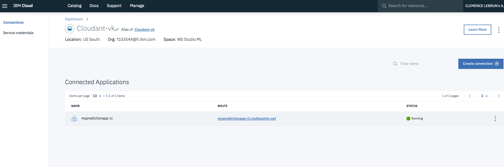
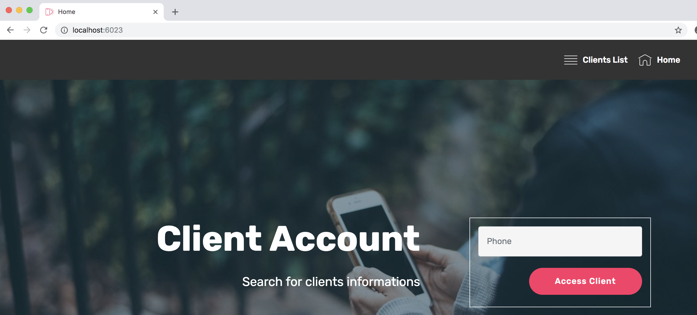
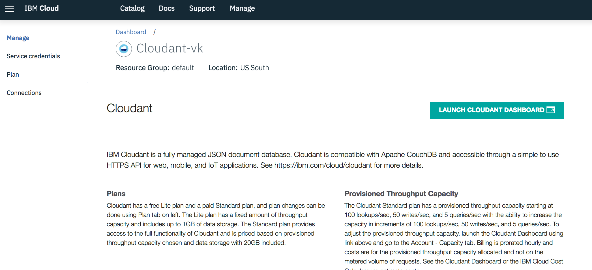

# Introduction

You will learn how to create and deploy you first app in Node.js with the IBM Cloud platform. You will also understand how to work locally with Node.js, connect to an IBM Cloud service and push your modifications to the IBM Cloud platform. 


# Objective

In the following lab, you will learn:

+ How to deploy a new Cloud Foundry app using the Node.js runtime
+ How to run a Node.js app locally
+ How to create and bind a new service 
+ How to use the IBM Cloud Command Line Interface


# Pre-Requisites

+ Get an [IBM Cloud Platform account](https://console.bluemix.net/registration/), or use an existing account.
+ Install the [IBM Cloud CLI](https://console.bluemix.net/docs/cli/reference/bluemix_cli/get_started.html#getting-started)
+ Install the [Git CLI](https://git-scm.com/downloads)
+ Install [Node.js](https://nodejs.org) to test your app locally


# Steps

1. [Create a new "hello world" web application using the web UI](#step-1---create-a-new-web-application-using-the-web-UI)
2. [Create a Cloudant service](#step-2---create-a-cloudant-service)
3. [Clone a new app](#step-3---clone-a-new-app)
4. [Push your new app](#step-4---push-your-new-app)


# Step 1 - Create a new "hello world" web application using the web UI

1. Log in to [IBM Cloud Platform console](https://console.bluemix.net).

2. Select the Region (e.g. United States) where you want to create your application. If needed, create an org and a space in that region.

3. Note these Region, Org and Space names, as you may need it later to target your work space.

4. Navigate to the Cloud Platform **Catalog**.

5. Look for the ***SDK for Node.js*** from the search bar and create an instance of this runtime (it is part of the Cloud Foundry App section). 

6. Give your app a unique name and unique host (e.g. mypredictionapp-[your-initials]). Keep the default Lite plan.

7. Wait for your application to start and click on "Visit App URL" to view your application.



The SDK for Node.js created a simple "Hello World!" web app that will become our starting point.

# Step 2 - Create a Cloudant service

You will need a database for your app, you are now going to create an instance of a Cloudant NoQL Database

1. Navigate to the Cloud Platform **Catalog**.

2. Look for the **Cloudant** service from the search bar and create an instance of the service in the same region than for your app and chose the **use both legacy credentials and IAM** authentication method. Keep the default Lite plan.

3. Once your service is created, you will bind it to your Node.js app. Click on the ***create connection*** button on the right and select your app.

  

  

4. Restage your application. Your application will restart and the service connection information will be made available to your application.

  

5. Navigate to the **Service credentials** tab on the left. Click on **View credentials** and save somewhere the "url" containing access, username and password. You will need it in the following steps.

  

# Step 3 - Clone a new app

1. Open a command line terminal and locate in a repositry dedicated to this workshop that you have created before, for example:

  ```
  $ cd workshopDatascienceIBM
  ```

2. Fork the source code of the Prediction app from Git: 
  
  ```
  $ git clone https://github.com/cllebrun/mypredictionapp
  ```

3. From to the directory of the starter code

  ```
  $ cd mypredictionapp
  ```
4. Open the **vcap-local.json** file and copy the Cloudant url you saved from the IBM cloud in Step 2, save it and close. It is to access your cloudant DB from your app running locally.


5. Get the node.js dependencies for this project

  ```
  $ npm install
  ```

6. Start the app

  ```
  $ npm start
  ```

  The console output will look like:
  
  ```
> NodejsStarterApp@0.0.1 start /Users/lebrun/Desktop/mypredictionapp
> node app.js

Loaded local VCAP { services: { cloudantNoSQLDB: [ [Object] ] } }
server starting on http://localhost:6023

  ```

7. Access the app with your web browser to vizualise your local node.js app.



8. Navigate to the "Clients list" page to initialize your Cloudant database with a list of clients.

9. Verify in your console logs that your Cloudant database has been populated with a list of 10 clients.

10. Go back to the IBM Cloud console and access your Cloudant DB UI clicking on its ***alias name*** and then on the **Launch Cloudant Dashboard**



11. Notice that a database "mydb" has been created with 10 elements. The clients are displayed in the table on the web app.

12. Navigate in the mydb DB or in the table to discover the clients attributes you have. Note one of the client id.

13. In this app a client id refer to the client phone number. If you go back to the home page of your app running locally, you can enter a client id in the phone number input to access the clients data. Ignore the "will churn" button for the moment.


14. Stop your app locally (ctrl+c)


# Step 4 - Push your local app to the cloud

Now you are going to push your app to IBM Cloud in order to access your app with a public url.

Cloud Foundry relies on the *manifest.yml* file to know what to do when you run the *cf push* command.

1. Open the **manifest.yml** file in your app source code and configure it with the name you gave to your "hello world app" you have created in Step 1. In my case it was "mypredictionapp-cl". Copy this name in "name". Also add the Cloudant service name in the service section:

  ```
  applications:
    + path: .
      name: <yourappname>
      environment_json: {}
      memory: 256M
      instances: 1
      disk_quota: 1024M
      services:
      - <yourcloudantservicename>
  ```


It basically defines one application taking its content from the current directory,
being deployed with **256MB**, with **one** instance.
The app is named **yourappname** and it is using **yourappname** as host name.
It has **1024MB** of disk space available.

If you want more information about the attributes you configuration here, look at : https://docs.cloudfoundry.org/devguide/deploy-apps/manifest.html
Several attributes are optional.

You are now going to use the IBM CLI you have downloaded in the prerequisites.

2. Connect to the IBM Cloud Platform from your terminal window:
Here, we use the api endoint : https://api.ng.bluemix.net because we are targeting the US South region to host our app.

  ```
  $ ibmcloud api https://api.ng.bluemix.net
  ```
Note that you could also use one of the following, if you createda a space before.
  * US SOUTH: https://api.ng.bluemix.net
  * US EAST: https://api.us-east.bluemix.net
  * UK: https://api.eu-gb.bluemix.net
  * GERMANY: https://api.eu-de.bluemix.net
  * SYDNEY: https://api.au-syd.bluemix.net

  
3. Login to the IBM Cloud Platform with your email and password (the same to login from the web console)

  ```
  $ ibmcloud login
  ```

4. If it is asked, select your account (you may have several accounts acces if you share apps with other people)

5. Target Cloud Foundry

  ```
  $   ibmcloud target --cf
  ```


6. Select the space where you want to push your application ( the same where your hello world app is hosted because you will erease it)

7. Check if you Cloudant service is accessible from your space:
   
  ```
  $ ibmcloud cf services
   ```

8. Push the app to the IBM Cloud Platform

  ```
  $ ibmcloud cf push
  ```

9. When the command completes, access the application running in the cloud to confirm your change was deployed

  ```
    Waiting for app to start...

  name:              mypredictionapp-cl
  requested state:   started
  instances:         1/1
  usage:             256M x 1 instances
  routes:            mypredictionapp-cl.mybluemix.net
  last uploaded:     Sat 13 Oct 02:35:14 +07 2018
  stack:             cflinuxfs2
  buildpack:         SDK for Node.js(TM) (ibm-node.js-6.14.4, buildpack-v3.22-20180904-1913)
  start command:     ./vendor/initial_startup.rb

       state     since                  cpu    memory        disk          details
 #0   running   2018-10-12T19:36:20Z   0.0%   48K of 256M   65.1M of 1G   

  mbp-de-clemence:mypredictionapp lebrun$ 
  ```
You can now access your app online ! Make sure you can access the data from Cloudant on your app.

# Resources

For additional resources pay close attention to the following:

- [Creating and Deploying apps with the IBM CLI](https://console.bluemix.net/docs/apps/create-deploy-cli.html#developing